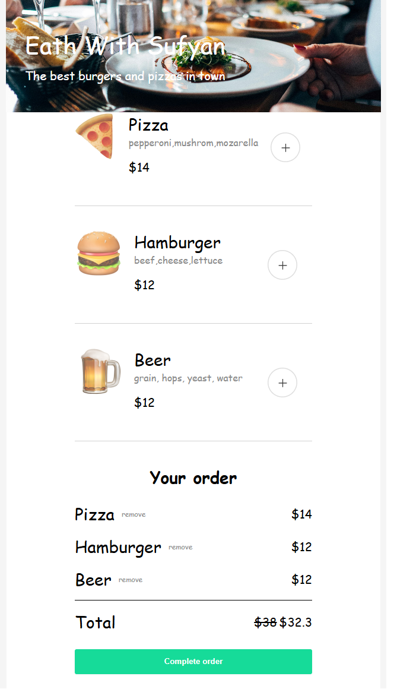

# Mobile Restaurant Menu

## Preview

## Srart Program

1. Open the complete folder on vs code/ code editor.
2. Run livee server

## Project walkthrough

1. First add items to create an order.
2. If you are happy with the order click "Complete order".
3. Fill out name, credit card number and CVV in order to be able to make the order. After that click "Complete order".
4. Your order has been submitted.
5. Review your experience.
